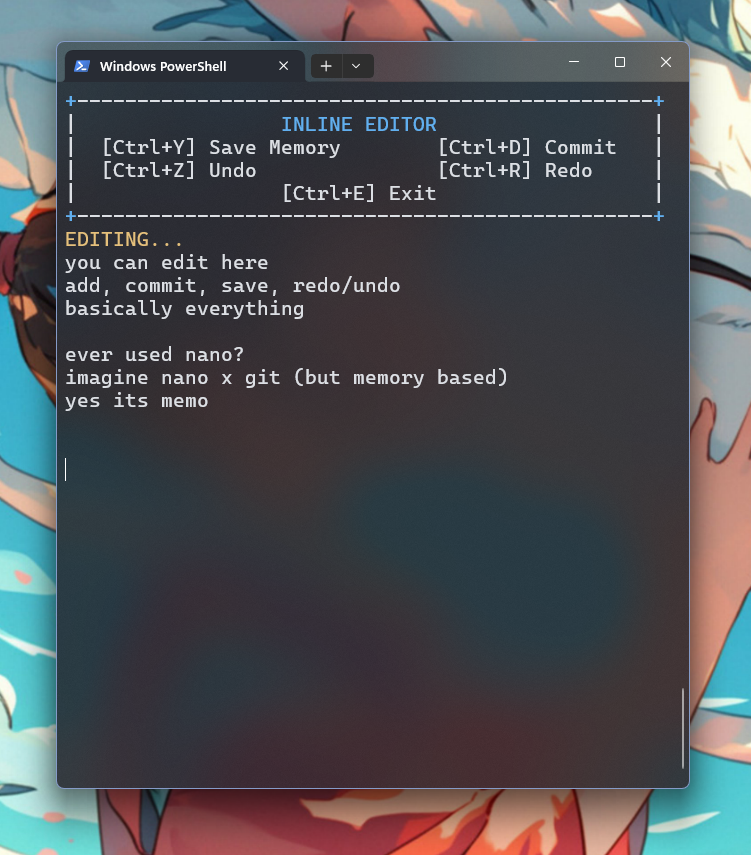
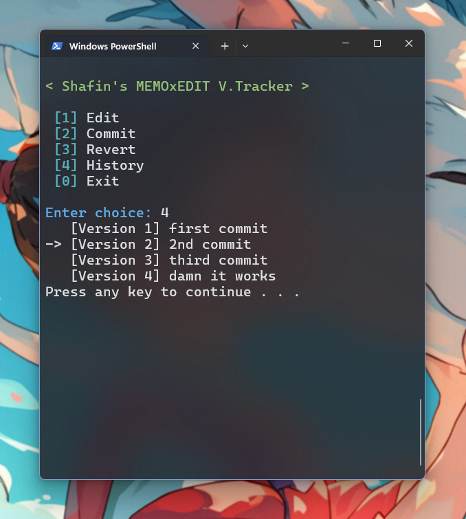

# MemoEdit Version Tracker 📝🌳

A lightweight, powerful console-based text editor with a built-in **Git-like version control system**. Manage your notes, code snippets, or any text with the ability to commit changes, revert to previous versions, and navigate your editing history—all from a simple, ANSI-powered terminal interface.

---

## 🎬 Demo Video

[](https://youtu.be/YDCiYAMMitk)

<iframe width="560" height="315" src="https://www.youtube.com/embed/YDCiYAMMitk" title="YouTube video player" frameborder="0" allow="accelerometer; autoplay; clipboard-write; encrypted-media; gyroscope; picture-in-picture" allowfullscreen></iframe>

---

## 📸 Screenshots

|                  **Inline Editor Interface**                   |                 **Main Menu & Version History**                  |
| :------------------------------------------------------------: | :--------------------------------------------------------------: |
|  |  |

---

## ✨ Key Features

- **🚀 Live Inline Editor**: A responsive text editing environment with real-time status updates.
- **📜 Git-like Versioning**:
  - **Commit**: Save snapshots of your work with custom messages.
  - **Revert**: Instantly jump back to any previous version in your history.
  - **History**: View a structured timeline of all your commits.
- **🔄 Workspace Persistence**: Save your work to memory and continue editing across different sessions.
- **⌨️ Advanced Shortcuts**: Full support for Undo (Ctrl+Z), Redo (Ctrl+R), Home, End, and Arrow key navigation.
- **🖥️ Dynamic UI**: The interface automatically adapts to console window resizing.
- **🎨 ANSI Rich Interface**: Uses modern ANSI escape sequences for a vibrant, colored terminal experience.

---

## 🎮 Controls & Shortcuts

### **In the Editor**

| Shortcut          | Action                                          |
| :---------------- | :---------------------------------------------- |
| `Ctrl + Y`        | **Save to Memory** (Updates the working buffer) |
| `Ctrl + D`        | **Commit** (Finalize changes with a message)    |
| `Ctrl + Z`        | **Undo** (Revert last edit)                     |
| `Ctrl + R`        | **Redo** (Reapply last undone edit)             |
| `Ctrl + E`        | **Exit Editor** (Return to Main Menu)           |
| `Arrows`          | Move cursor Up/Down/Left/Right                  |
| `Home / End`      | Jump to start or end of text                    |
| `Backspace / Del` | Delete characters                               |

### **Main Menu**

- `[1]` **Edit**: Open the inline editor.
- `[2]` **Commit**: Commit current unsaved changes.
- `[3]` **Revert**: Go back to a specific version number.
- `[4]` **History**: List all saved versions.
- `[0]` **Exit**: Close the application.

---

## 🛠️ Performance & Tech Stack

- **Lanuage**: C++
- **Data Structure**: Custom **Doubly Linked List** implementation for the Version Control System (no STL containers for core versioning logic).
- **Terminal Control**: Windows-specific `conio.h` and ANSI escape sequences for cursor manipulation and styling.
- **Memory Management**: Manual memory handling for version nodes to ensure efficiency.

---

## 🚀 Getting Started

### **Prerequisites**

- **Windows OS** (Required for `windows.h` and `conio.h` support).
- **G++ Compiler** (MinGW recommended).

### **Installation**

1. **Clone the repository**:

   ```powershell
   git clone https://github.com/beingshafin/MemoEdit-Version-Tracker.git
   cd MemoEdit-Version-Tracker
   ```

2. **Compile the program**:

   ```powershell
   g++ memo-editor.cpp -o memo-editor.exe
   ```

3. **Run the application**:
   ```powershell
   ./memo-editor.exe
   ```

---

## ⚙️ How It Works

The core of the version tracker is a **Doubly Linked List** where each `VersionNode` stores:

- A unique `versionId`.
- A descriptive `message`.
- The full `content` of the document at that point in time.

When you revert to a past version and make a new commit, the editor automatically handles **branching logic** by pruning "future" versions from the current point, just like Git's detached HEAD behavior when followed by a new commit.

---

Made with 💙 by **Shafin**
